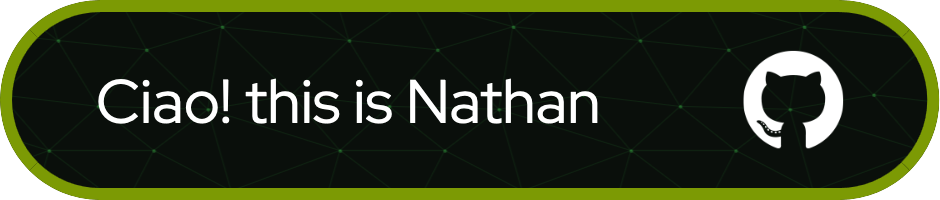

Driven by a passion for innovation and a love for solving complex problems, I thrive in dynamic environments where I can tackle challenges with creativity and determination.
 
 

### About me:
- My hobbies are photographer and DJ
- Love adventure and learn something new
- Hit me up if you want to collab working on any programing projects

 

### 🔨 Languages and Frameworks:

[)

